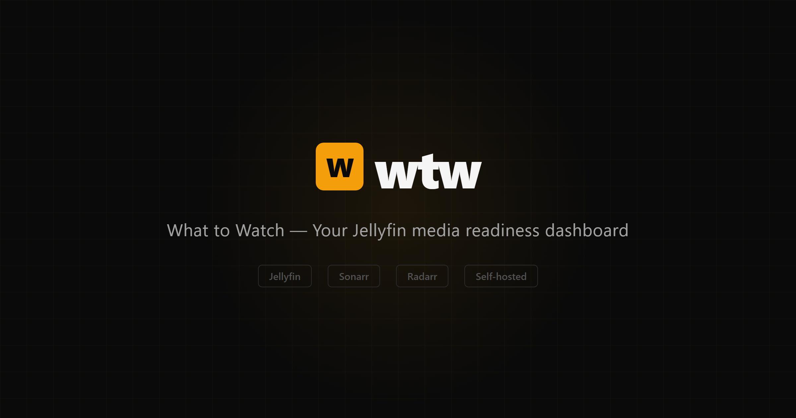
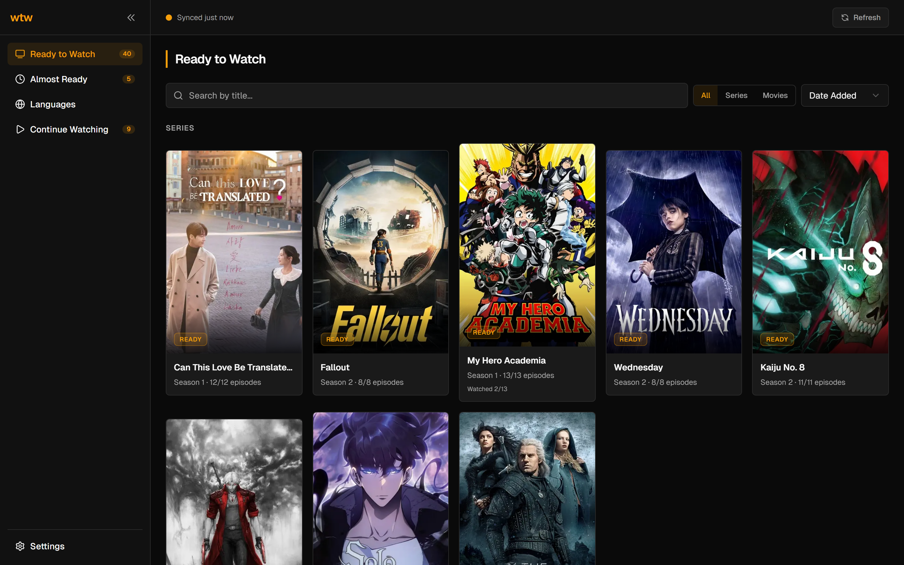
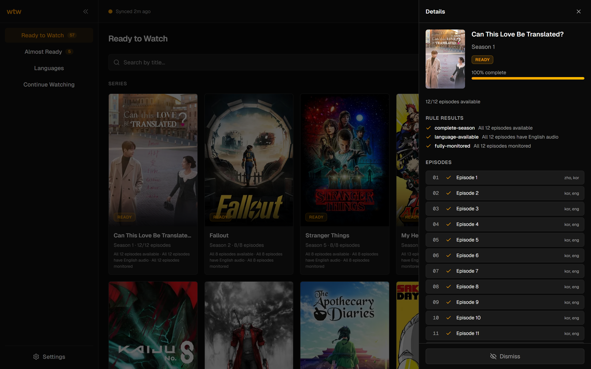
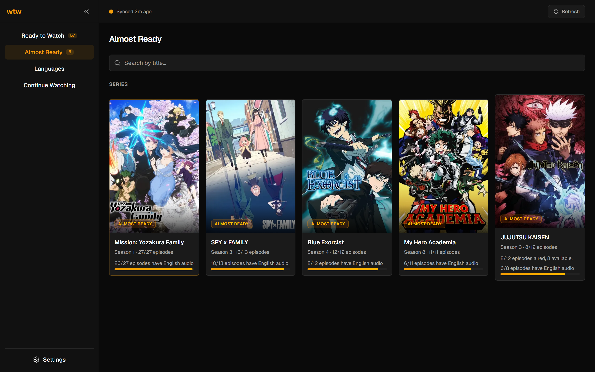
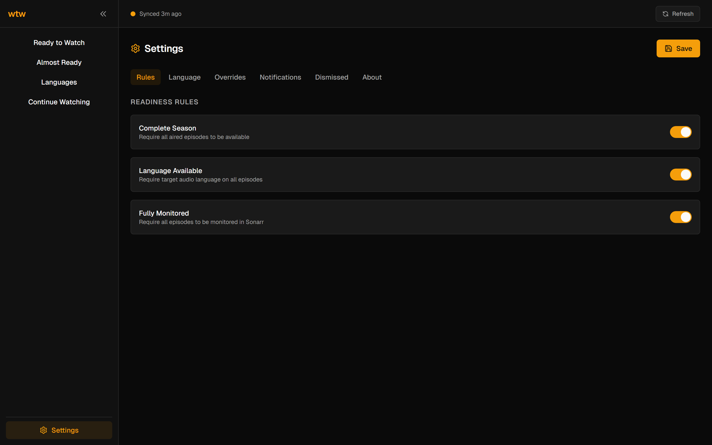
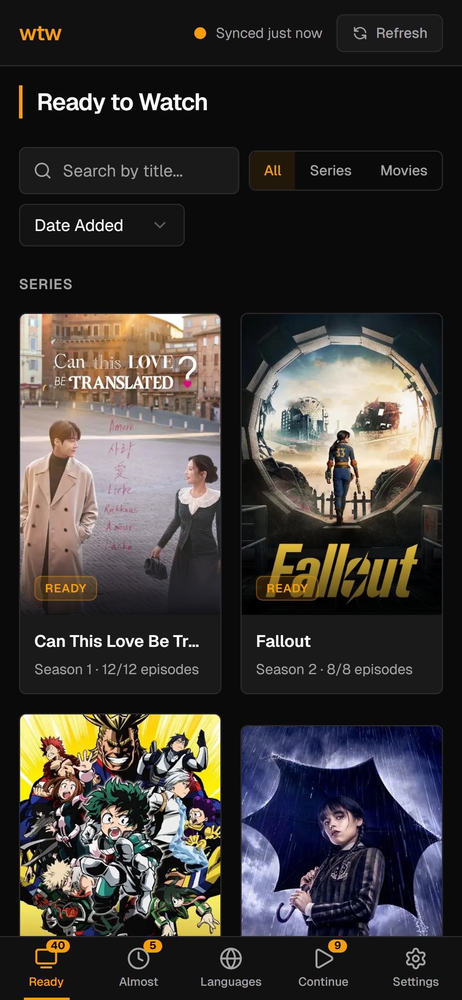

<p align="center">
  
</p>

<p align="center">
  <strong>A self-hosted dashboard that shows what's ready to watch across your Jellyfin, Sonarr, and Radarr media stack.</strong>
</p>

<p align="center">
  <a href="https://github.com/1-Felix/wtw/pkgs/container/wtw"></a>
  <a href="https://github.com/1-Felix/wtw/releases"></a>
  <a href="LICENSE"></a>
</p>

---

wtw syncs your media services on a schedule and evaluates each season and movie against configurable readiness rules — like requiring a complete season, a preferred audio language, or full monitoring in Sonarr — so you only see media that's actually ready to watch.



## Features

- **Ready to Watch** — series and movies that pass all your readiness checks
- **Almost Ready** — items close to meeting criteria with progress indicators
- **Continue Watching** — in-progress items based on Jellyfin watch history
- **Language Overview** — per-episode audio/subtitle language breakdown grid
- **Detail Panel** — rule results, episode status, and language info per item
- **Search, Filter & Sort** — find items by title, filter by type, sort by date or name
- **Setup Wizard** — guided first-run experience to connect your services from the browser
- **Settings UI** — configure rules, language targets, per-series overrides, and webhooks
- **Discord & Webhook Notifications** — get notified when media becomes ready
- **Mobile-First** — responsive layout with bottom tab bar and swipe gestures

<details>
<summary>More screenshots</summary>

### Detail Panel


### Almost Ready


### Settings


### Mobile


</details>

## Quick Start

Create a `docker-compose.yml`:

```yaml
services:
  wtw:
    image: ghcr.io/1-felix/wtw:latest
    container_name: wtw
    restart: unless-stopped
    ports:
      - "3000:3000"
    volumes:
      - wtw-config:/config

volumes:
  wtw-config:
```

```bash
docker compose up -d
```

Open [http://localhost:3000](http://localhost:3000) — the setup wizard will walk you through connecting Jellyfin, Sonarr, and Radarr. The first sync takes about 30 seconds.

> The Docker image includes a built-in healthcheck on `/api/health` for orchestrators like Portainer or Kubernetes.

<details>
<summary>Pre-configure with environment variables</summary>

If you prefer to skip the setup wizard, pass your service credentials as environment variables. These take priority over any values configured through the UI.

```yaml
services:
  wtw:
    image: ghcr.io/1-felix/wtw:latest
    container_name: wtw
    restart: unless-stopped
    ports:
      - "3000:3000"
    environment:
      JELLYFIN_URL: "http://jellyfin:8096"
      JELLYFIN_API_KEY: "your-jellyfin-api-key"
      JELLYFIN_USER_ID: "your-jellyfin-user-id"

      # Optional: Sonarr integration
      # SONARR_URL: "http://sonarr:8989"
      # SONARR_API_KEY: "your-sonarr-api-key"

      # Optional: Radarr integration
      # RADARR_URL: "http://radarr:7878"
      # RADARR_API_KEY: "your-radarr-api-key"

      # Optional: sync interval in minutes (default: 15)
      # SYNC_INTERVAL_MINUTES: 15
    volumes:
      - wtw-config:/config

volumes:
  wtw-config:
```

Jellyfin is the only required service. Sonarr and Radarr are optional — when configured, they provide richer metadata that powers additional readiness rules (complete season, fully monitored).

</details>

<details>
<summary>Docker Run</summary>

```bash
docker run -d \
  --name wtw \
  -p 3000:3000 \
  -v wtw-config:/config \
  ghcr.io/1-felix/wtw:latest
```

</details>

## Configuration

All configuration is managed from the **Settings** page in the dashboard — rules, language targets, per-series overrides, notification webhooks, and service connections.

Settings, dismissed items, and notification history are persisted in a SQLite database at `/config/wtw.db` and survive container restarts.

## Development

### Prerequisites

- Node.js 22+
- [pnpm](https://pnpm.io/)

### Setup

```bash
git clone https://github.com/1-Felix/wtw.git
cd wtw
pnpm install
```

### Running

```bash
# Create .env.local with your service URLs and API keys
cp .env.example .env.local  # edit with your values

pnpm dev
```

### Testing

```bash
pnpm test          # single run
pnpm test:watch    # watch mode
```

### Docker Build

```bash
docker build -t wtw .
docker run -p 3000:3000 -v wtw-config:/config wtw
```

## License

MIT
